# 🧠 深度学习实践与学习 Deep Learning Practice

<div align="center">

[](https://www.python.org/)
[](https://pytorch.org/)
[](https://www.tensorflow.org/)
[](LICENSE)

**一个系统化的深度学习教育与实践仓库**

[特色](#特色) • [快速开始](#快速开始) • [学习路径](#学习路径) • [项目结构](#项目结构) • [技术栈](#技术栈)

</div>

---

## 📖 项目简介

本仓库是一个**渐进式深度学习教育项目**，旨在通过理论学习、从零实现、框架应用的三阶段学习方法，帮助学习者系统掌握深度学习核心技术。

### 核心理念

- 📚 **理论先行** - 深入理解数学原理和算法本质
- 🔨 **从零实现** - 亲手编写核心算法，掌握实现细节
- 🚀 **框架应用** - 使用 PyTorch/TensorFlow 进行实践
- 🎯 **对比学习** - PyTorch 与 TensorFlow 双框架对比
- 💡 **交互探索** - 基于 Jupyter 的交互式学习环境

---

## ✨ 特色

- ✅ **完整的《动手学深度学习》中文教材实现**
- ✅ **从基础到高级的系统化学习路径**
- ✅ **双框架实现对比（PyTorch & TensorFlow）**
- ✅ **前沿技术实践**（Flash Attention、Diffusion Models、Transformer 等）
- ✅ **中文注释配合英文代码**，降低学习门槛
- ✅ **完整的训练可视化和模型评估**
- ✅ **支持 CPU/GPU 训练**，适配不同硬件环境

---

## 🚀 快速开始

### 环境要求

- Python 3.10.6+
- CUDA（可选，用于 GPU 加速）

### 安装步骤

#### 1. 克隆仓库

```bash
git clone https://github.com/Hao-yiwen/deeplearning.git
cd deeplearning
```

#### 2. 创建虚拟环境

**方式一：使用 venv（推荐）**

```bash
python -m venv venv

# Linux/macOS
source venv/bin/activate

# Windows
venv\Scripts\activate
```

**方式二：使用 conda**

```bash
conda create -n d2l python=3.10
conda activate d2l
```

#### 3. 安装依赖

```bash
pip install -r requirements.txt
```

### 启动 Jupyter

```bash
# 启动 Jupyter Lab（推荐）
jupyter lab

# 或启动 Jupyter Notebook
jupyter notebook
```

---

## 📚 学习路径

### 🎯 推荐学习顺序

```mermaid
graph LR
    A[基础数学] --> B[线性回归]
    B --> C[多层感知机]
    C --> D[卷积神经网络]
    D --> E[循环神经网络]
    E --> F[Transformer]
    F --> G[生成模型]
```



### 1️⃣ 入门阶段 - 基础概念

**位置**: `d2l-zh/` 和 `tensorflow/week1/`

- 线性代数基础
- 微积分与自动微分
- 概率论基础
- 数据操作与预处理

**起点**:
- `tensorflow/week1/practise_1_data.ipynb` - 数据操作
- `tensorflow/week1/practise_2_linear-algebra.ipynb` - 线性代数

### 2️⃣ 基础模型 - 从零实现

**位置**: `pytorch_2024/` 和 `tensorflow/week2/`

- 线性回归（从零实现 → 框架实现）
- 多层感知机（MLP）
- Softmax 回归
- 损失函数与优化器

**起点**:
- `pytorch_2024/practise_1_getstarted.ipynb` - Fashion-MNIST 入门
- `tensorflow/week2/practise_1_linear-regression-scratch.ipynb` - 线性回归从零开始

### 3️⃣ 深度学习核心 - CNN & RNN

**位置**: `pytorch_2024/week3/`

- 卷积神经网络（CNN）
- 循环神经网络（RNN）
- LSTM 与 GRU
- 批标准化与 Dropout

**起点**:
- `pytorch_2024/week3/practise_1_linear-regression-scratch.ipynb`
- `pytorch_2024/week3/practise_2_mlp-scratch.ipynb`

### 4️⃣ 前沿技术 - Transformer & 生成模型

**位置**: `pytorch_2024/week4/` 和 `pytorch_2025/`

- Transformer 架构
- 注意力机制
- 文本生成
- Diffusion Models
- Flash Attention（内存优化）

**起点**:
- `pytorch_2024/week4/practise_1_rnn.ipynb`
- `pytorch_2025/month_7/practise_1_flashattention.ipynb`

---

## 📁 项目结构

```
deeplearning/
├── 📘 d2l-zh/                  # 《动手学深度学习》完整实现
│   ├── pytorch/                # PyTorch 版本实现
│   └── tensorflow/             # TensorFlow 版本实现
│
├── 🔥 pytorch_2024/            # 2024 PyTorch 系统学习
│   ├── practise_1_getstarted.ipynb  # Fashion-MNIST 快速入门
│   ├── week3/                  # 核心模型实现（Linear, MLP, CNN, RNN）
│   └── week4/                  # 高级主题（Transformer, 文本生成）
│
├── ⚡ pytorch_2025/            # 2025 最新技术实践
│   ├── month_7/                # Flash Attention 优化
│   ├── month_10/               # 最新实践
│   └── month_11/               # 进行中的研究
│
├── 🧮 tensorflow/              # TensorFlow 学习路径
│   ├── week1/                  # 基础（数据、线代、微积分、概率）
│   └── week2/                  # 线性回归实现
│
├── 🎯 practise/                # 实用工具和实验
│   ├── practise_1_image_translate.ipynb  # 图像处理
│   └── practise_2_pdb.py       # Python 调试
│
├── 📄 CLAUDE.md                # Claude Code 使用指南
├── 📄 README.md                # 项目文档（本文件）
└── 📄 requirements.txt         # 依赖清单
```

---

## 🛠️ 技术栈

### 深度学习框架

- **PyTorch 2.1.0** - 主要框架，灵活且易于调试
- **TensorFlow** - 对比学习和生产部署
- **D2L 1.0.3** - 《动手学深度学习》配套工具库

### 开发工具

- **Jupyter Lab/Notebook** - 交互式开发环境
- **NumPy** - 数值计算
- **Pandas** - 数据处理
- **Matplotlib/Seaborn** - 数据可视化

### 模型与算法

| 类别 | 技术 | 位置 |
|------|------|------|
| **基础模型** | Linear Regression, Logistic Regression, MLP | `week3/`, `tensorflow/week2/` |
| **卷积网络** | CNN, ResNet, VGG | `week3/` |
| **序列模型** | RNN, LSTM, GRU | `week4/` |
| **注意力机制** | Self-Attention, Multi-Head Attention | `week4/` |
| **Transformer** | Encoder-Decoder, BERT, GPT | `week4/` |
| **生成模型** | VAE, Diffusion Models | `week4/` |
| **优化技术** | Flash Attention, Gradient Checkpointing | `pytorch_2025/month_7/` |

---

## 💻 开发指南

### 运行 Python 脚本

```bash
# 基本运行
python script_name.py

# 使用 GPU（如果可用）
python script_name.py --device cuda
```

### Jupyter Notebook 最佳实践

**标准 Notebook 结构**：

```python
# 1. 导入依赖
import torch
import torch.nn as nn
from torch.utils.data import DataLoader

# 2. 数据加载与预处理
train_data = load_data()

# 3. 模型定义
class MyModel(nn.Module):
    def __init__(self):
        super().__init__()
        # 层定义

    def forward(self, x):
        # 前向传播
        return x

# 4. 训练循环
device = torch.device('cuda' if torch.cuda.is_available() else 'cpu')
model = MyModel().to(device)

for epoch in range(num_epochs):
    # 训练代码
    pass

# 5. 评估与可视化
evaluate(model, test_data)
```

### 代码规范

- ✅ **中文注释** - 用于教育性解释
- ✅ **英文命名** - 变量和函数使用英文
- ✅ **模块化设计** - 可复用组件
- ✅ **渐进式复杂度** - 从简单到复杂
- ✅ **完整文档** - Notebook 内置详细说明

---

## 📝 常见问题

<details>
<summary><b>Q: 我应该从哪里开始学习？</b></summary>

**A:**

- **纯新手**: 从 `tensorflow/week1/` 的基础数学开始
- **有 Python 基础**: 从 `pytorch_2024/practise_1_getstarted.ipynb` 开始
- **有深度学习基础**: 直接进入 `pytorch_2024/week4/` 或 `pytorch_2025/`
</details>

<details>
<summary><b>Q: 没有 GPU 可以学习吗？</b></summary>

**A:** 可以！所有代码都支持 CPU 运行。对于大型模型，可以：
- 减小 batch size
- 使用更小的模型
- 减少训练轮数
</details>

<details>
<summary><b>Q: PyTorch 和 TensorFlow 应该学哪个？</b></summary>

**A:** 建议先学 PyTorch（更灵活，适合研究和学习），然后学 TensorFlow（更适合生产部署）。本仓库提供双框架实现，可以对比学习。
</details>

<details>
<summary><b>Q: 如何获取数据集？</b></summary>

**A:** 代码会自动下载常用数据集（如 Fashion-MNIST, MNIST）。大型数据集请参考各 Notebook 的说明。
</details>

---

## 🤝 贡献

欢迎贡献！如果你想改进这个项目：

1. Fork 本仓库
2. 创建特性分支 (`git checkout -b feature/AmazingFeature`)
3. 提交更改 (`git commit -m 'Add some AmazingFeature'`)
4. 推送到分支 (`git push origin feature/AmazingFeature`)
5. 开启 Pull Request

---

## 📄 许可证

本项目采用 MIT 许可证 - 详见 [LICENSE](LICENSE) 文件

---

## 🙏 致谢

- [《动手学深度学习》](https://d2l.ai/) - 优秀的深度学习教材
- [PyTorch](https://pytorch.org/) - 强大的深度学习框架
- [TensorFlow](https://www.tensorflow.org/) - 谷歌开源深度学习平台

---

## 📞 联系方式

如有问题或建议，欢迎：
- 提交 Issue
- 发起 Discussion
- 提交 Pull Request

---

<div align="center">

**⭐ 如果这个项目对你有帮助，请给一个 Star！⭐**

Made with ❤️ for Deep Learning Learners

</div>
